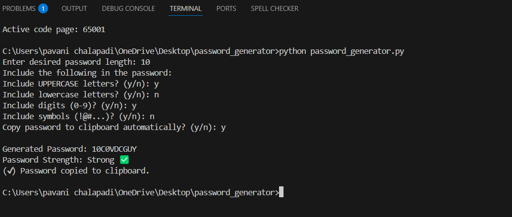

# 🔐 OIBSIP_Python_Programming_Task1 – Password Generator

## 🔍 Objective:
To create a secure and customizable Password Generator using **Python**, allowing users to generate strong passwords with options to include uppercase, lowercase, digits, and symbols.

---

## ⚙️ Tools Used:
- Python 3
- Built-in `random` and `string` modules
- (Optional) `pyperclip` module for clipboard functionality
- Visual Studio Code (VS Code)

---

## 📝 Features:
- User-defined password length (max: 15 characters)
- Option to include:
  - Uppercase letters
  - Lowercase letters
  - Digits
  - Symbols
- Password strength indicator
- Option to copy password to clipboard

---

## ▶️ How to Run in VS Code:

### 🔹 Step 1: Open Project in VS Code
Open the folder containing `password_generator.py`.

### 🔹 Step 2: Install pyperclip (optional)
If you want the clipboard feature, install this module:
```bash
pip install pyperclip
🔹 Step 3: Run the Script
In the VS Code terminal:

bash
Copy
Edit
python password_generator.py
📸 Screenshot:
🔹 Terminal Output



✅ Outcome:
A command-line password generator that lets the user control password length and character types, with optional clipboard copy and strength rating.

📁 Folder Structure:
Copy
Edit
OIBSIP_Python_Programming_Task1/
├── password_generator.py
├── password_cli_output.png
└── README.md
🧑‍💻 Author:
Pavani Chalapadi
Python Programming Intern – Oasis Infobyte (OIBSIP)

#OasisInfobyte #PythonProgramming #PasswordGenerator #Internship #LearningByDoing #PythonProjects

yaml
Copy
Edit
